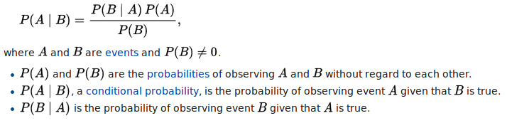
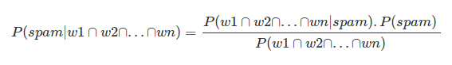
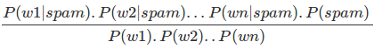
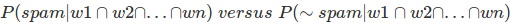

# SPAM CLASSIFICATION USING NAIVE BAYES

# AHMED HUMAYUN

The SMS Spam Collection is a set of SMS tagged messages that have been collected for SMS Spam research. It contains one set of SMS messages in English of 5,574 messages, tagged acording being ham (legitimate) or spam.

The files contain one message per line. Each line is composed by two columns: v1 contains the label (ham or spam) and v2 contains the raw text.

A spam classifier was built using the probability theorem called Bayes Theorem-\

If following dataset has a message with a unique set of words in the sequence (w1,w2,w3,...wn), we attempt to find -

The above expression can be simplified if based on the assumption that all the words occurance is independent of each other words-

Hence for successful classification we need to determine which is greater-

Ref - The Elements of Statistical Learning - Jerome H. Friedman, Robert Tibshirani, and Trevor Hastie

Dataset - https://www.kaggle.com/uciml/sms-spam-collection-dataset

